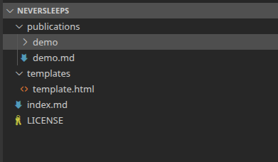

# First Post

Your content in **Markdown** syntax.

## Sub

```python
import re

s = "Hello, welcome to the world of Python."
pattern_to_find = "welcome"

match = re.search(pattern_to_find, s)

if match:
    print("Pattern found!") # This will print "Pattern found!"
else:
    print("Pattern not found.")
```

```
othercode
```

