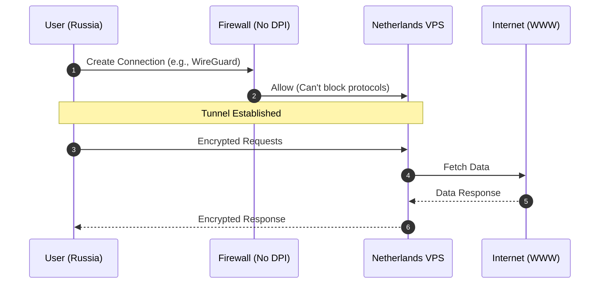
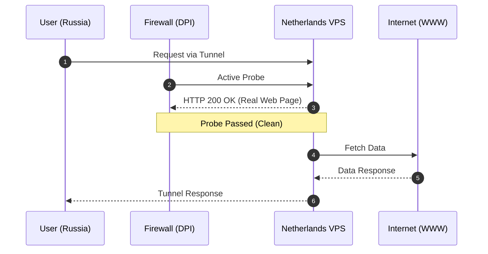
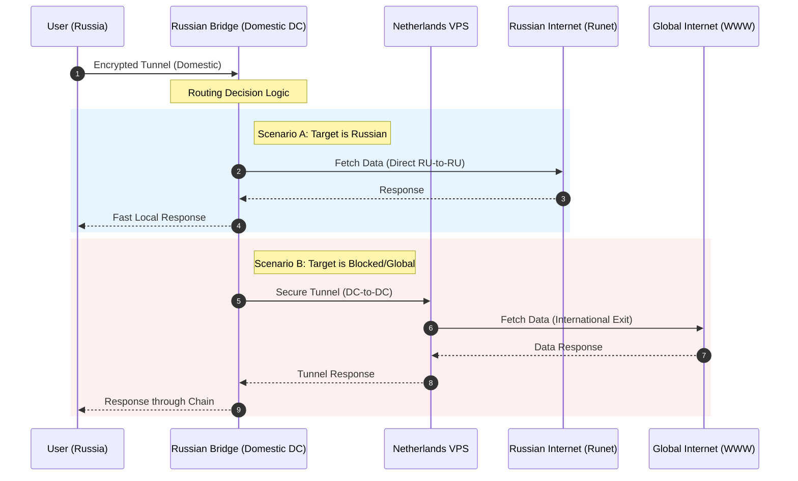
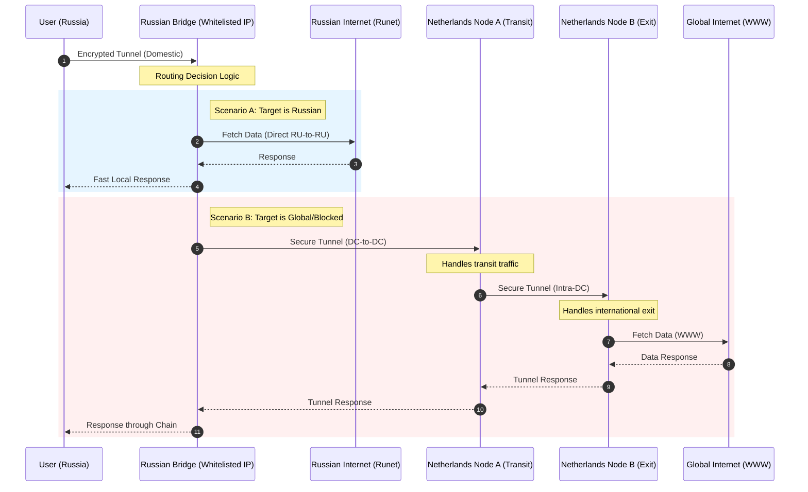

# Punching through internet censorship in 2026

## Prelude

5-10 years ago the most prevalent view on internet censorship in Russia was that it was effectively impossible.
DPI systems needed to inspect traffic would have costed a stupidly high amount of money (and then some, because corruption).
Professionals needed to setup those systems would be impossible to find, because nobody with a sense of civic duty or with a brain would work on those.
Even if the systems were to be implemented, levels of collateral damage due to blocking would be so immense that the government would have to stop.
Blocking something like Cloudflare would break half of the modern internet. Blocking big services YouTube would cause immense outrage, especially with no real alternatives available for these locally.

However, he we are today. Money for all the overpriced DPIs was found. Sure, some other expenditures had to be cut, but what can you do.
It also turned out that there are plenty of people who are willing to build a censorship apparatus. 
This is the most surprising thing to me: somebody actually agreed to work on making life for their compatriots worse, and they mostly do it for shittiest salaries available at Russian IT (salaries of people building digitized systems for conscription got [leaked](https://istories.media/stories/2025/12/22/chto-mi-uznali-ob-ustroistve-reestra-otveti-na-glavnie-voprosi/), and these are about 800$ on average). It is truly fascinating just how pathetic some people can be.

Once the systems were at place, the only thing slowing down the censorship was the political opposition. 
Sadly, over time, most prominent figures ended up in jail, or immigration, or dead. 
Once the war started, all bets were off: levels of repression increased greatly, and more and more pieces of the internet became blocked, including CDNs and big services like YouTube. Even more, under the guise of protecting people from drone attacks, whitelists were rolled out on mobile internet in most of the country. 
Did nothing against the drones, but now the majority of the country don't have access to the internet: instead they can access a closed list of government-approved services. You can use (some) russian services like maps and delivery, your banking works, you can chat through state-approved messengers and read state-approved media. People might not like this, but what are you gonna do, protest?

## Evolution of VPNs and anti-censorship tooling

All that said, let's focus on the technical details here. 
This story allows us to examine the evolution of VPNs - let's look at how tooling and network architecture changed over the years to allow people somewhat free access to the net.

### Level 1

At first, the blocking was simple. Provider DNSes would blackhole "bad" domains, and traffic to IPs associated with these domains was blocked.
It allowed for some fun party tricks. I remember a story there some guy bought a blocked domain and pointed it to hundreds of IPs, [blocking](https://www.cnews.ru/news/top/2017-06-08_nesovershenstvo_sistemy_blokirovki_sajtov_uronilo) a bunch of popular sites.

Block evasion was also simple. Sometimes you just had to set your DNS to 8.8.8.8. 
If you had to set up a proper VPN, infrastructure was as simple as it gets: you buy a VPS and run something like OpenVPN.
You could even set the thing up in Russia for better latency: non-residential traffic wasn't filtered at all.

This implementation was trivial to block:
* VPN protocols can be easily identified. You don't even need DPI, in most cases people used default ports.
* Machines were usually used only for traffic forwarding. With the exception of SSH, the VPN was the only service running. That can be detected with active probing.

### Level 2

This brings us to a second option, which requires a just bit more sophistication, but is much harder to reliably block. In fact, this approach still mostly works in 2026, as long as you don't try to scale it up.

You use some harder to detect protocol (think X-Ray) to protect yourself from basic DPI systems, and you harden your VPS from active probing.
In my experience, just setting up a simple website with Caddy is enough for the machine to appear "legitimate".

Note that sometimes detections for obfuscated protocols come up (something like "this VPN sets this bit in this type of packet, and normal devices don't usually do that").
When these are discovered, mass bans can happen overnight.

However, you will still encounter issues with this approach:
* You are still running a lot of "weird" traffic. Moreover, you are running it to the server outside of the country. This alone can cause your IP to be blocked, or traffic to be throttled.
* Exit node for all your traffic is outside of the country. That means that a lot of local services won't work, especially banks and government websites.
* Your enter node is your exit node. A service you are accessing can figure out that your IP is from Netherlands, but you physically are in Russia. This information is [relayed](https://www.rbc.ru/technology_and_media/02/04/2026/69ce5f9b9a7947408a421405) to the censor, VPN gets blocked.

### Level 3

Let's add another server. You are connecting to a bridge in Russia, which then routes your traffic to exit node in Netherlands.
Traffic for Russian IPs is routed straight from the bridge, without leaving the country. 
This way your latency is better, and you don't send a bunch of suspicious traffic across the border: instead you send it to a local server (which is less suspicious), and then this server just happens to send a lot of data to Netherlands (which is also not as suspicious, since this is not residential traffic).
Russian websites also don't know you are using a VPN now.

This approach is much more reliable. It also helps that even if your exit node goes down, you just have to reconfigure your russian bridge, no updates to the clients required.
However, a new attack vector emerges. Say your user just happens to have a government-approved messenger on their phone. When routed via VPN, it can get your exit node IP, leading to a block.

Even if the messenger itself is not routed through VPN (most software nowdays supports per-app tunnelling), VPN clients are usually not written with an adversarial code running on client devices in mind.
Many VPN clients [setup](https://habr.com/en/articles/1020080/) an authenticated SOCKS5 server when working. This government-approved application can detect it, connect to it and leak your exit node IP this way.

Another problem is whitelisting. Whitelists don't (yet) apply to datacenter traffic, but they will limit ASes/IP ranges your clients can connect to, even if your bridge is in Russia.
That means that your VPN might stop working entirely when whitelists are enabled. In some regions of Russia, that means all the time.

### Level 4

There are two things we could improve. First, let's add another hop. Instead of routing traffic from russian bridge to exit node directly, we add an intermediate foreign node.
This way, even if our exit IP gets burned, from the point of the censor (which can only monitor traffic in Russia) we are not communicating with it, so all is fine.
We just happen to send a bunch of traffic to another host, preferably in the same DC for latency reasons. This host's IP is not directly exposed anywhere.

Secondly, we need a bridge IP from whitelists. Since Russian government doesn't want to break all the internet, only most of it, there are still a bunch of ASes which work when all else is blocked.
Go through [the list](https://github.com/chebur-net/russia-mobile-whitelist), and you can see that there are some web hosters (Yandex Cloud, VK Cloud, a bunch of anti-DDOS providers).
Buy a virtual machine, rotate a bunch of IPs, and you will find something that works. 
The only catch is that it can be hard to test if IP is whitelisted if you are not in a region where whitelists are enforced, but you can figure it out if you are motivated enough.

This approach is still not bulletproof. Your tunnels can get detected by DPI, or some fancy AI-based traffic analysis.
It can get harder to find whitelisted IPs. DC-to-DC traffic can get more heavily monitored. A lot of things can go wrong here, but this architecture seems to be working fine for now.

## Another techniques and approaches

There are tools which "scramble" your traffic to make it harder for DPIs to analyze it. 
For instance, you can play around with traffic fragmentation, or HTTP headers, to try to break DPIs. Something simple as changing `Host: blocked.com` to `hOsT:BLoCKed.Com` might still be fine to the server you are trying to access, but break the DPI. One popular example is [GoodbyeDPI](https://github.com/ValdikSS/goodbyeDPI). This by itself is not that effective for a while now, but might still be used in other countries or in conjunction with other tooling.

You can also try traffic smuggling. Your government-approved messenger probably has video calls, and you might [try](https://github.com/cacggghp/vk-turn-proxy) to pass your traffic via TURN servers. Sadly, I never got it to work.
[dnstt](https://github.com/tladesignz/dnstt) is another option. This one actually somewhat worked when I tested it (try using it with your provider's DNS to bypass whitelists), but it is very brittle and stupidly slow.

## Another problems you'll have to face

When your infrastructure gets burned, you'll have to rotate your connection configs/clients. Problem is, your preferred communication methods (often Telegram/Web) probably won't work without your VPN.
Word of mouth works best here: you help connect some people, they then help their friends and family, and so on.

All your traffic will be outbound from DC IPs, and probably ones with questionable reputation. Your users will

You'll also have to pay for that nice infra of yours. 
You'll probably want to keep a bank account in a foreign country (preferably several) with money for at least several months of operation, and have some proven methods to move money there.
If you are trying to build a business on that and monetize the thing, you should also consider that getting money from the people will be hard. 
Also, the government will probably consider you a criminal, so either up your opsec game, or start by moving to another country.

---

If you need to build a VPN for small-scale use, you've got yourself a basic guide. 
Even if simpler solutions work, you are better off jumping to more complex stuff, otherwise there is a good chance your network will get blocked at most inconvenient times (for instance, right before a major protest). One thing you should take away from this text is that you have to stop the situation from getting to this point: you can't solve political problems with technical solutions. Fund your favorite politician, vote, protest, whatever - just do something, don't sit idly watching things around you turn from bad to worse.

Fun fact: in Russia, a lot of services pushed by the government as replacements for foreign platforms are developed by VK. 
If you had the foresight that a war would start soon, leading to all their competitors getting be blocked and them receiving a lot of government money, you could by some shares in it.
If you bought them 31 Jan, 2022, and sold these today, you'd loose 57% of your money, and that is before inflation.